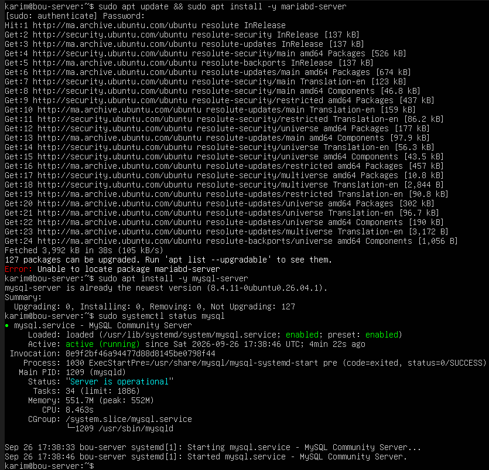

# Ubuntu Server MySQL Database Hardening & Access Control

## Executive Summary
This repository documents the installation, baseline security configuration, and service management of MySQL Server on Ubuntu Server, tailored for secure enterprise environments and system integration best practices.

---

## Technical Specifications & Infrastructure
* **Operating System:** Ubuntu Server 26.04.1 LTS
* **Database Engine:** MySQL Community Server
* **Security Context:** Local service deployment with restricted access and automated status verification.

---

## Automation Script
An automated setup script (`harden-mysql.sh`) is included to handle service verification and status monitoring.

---

## Proof of Work & Verification

### Active MySQL Database Service Status

